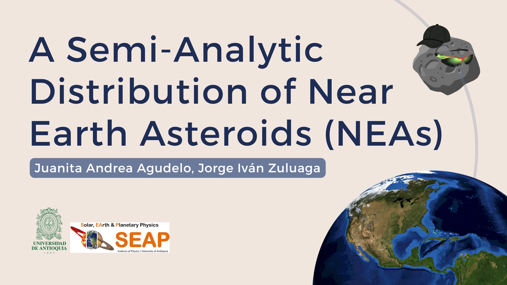

# quasiNEA ☄️
## Quasi-Analytic NEA Distribution

<p align="center">
  
</p>

This repository contains the code and resources developed for my thesis focused on the  
**analytical and quasi-analytical study of the distribution of Near-Earth Asteroids (NEAs)**.

The central aim is to investigate and model the distribution of NEAs using a combination of:

- Analytical and quasi-analytical methods  
- Empirical datasets from public space databases  
- Numerical simulations and optimization techniques  

The project integrates theoretical modeling with observational constraints to better understand  
the orbital structure, spatial distributions, and potential observational biases affecting NEA populations.

---

## 📓 Main Notebooks: 

- 🔁 **Back-in-time integration of fireball impact data** to compare impact trajectories with modeled distributions.
- 📊 **Fitting the NEA distribution** from JPL Small-Body Database using the `multimin` optimization package.
- 🌌 **Fitting the NEOPOP model distribution** (Near-Earth Object Population Observation Program) for comparative analysis.
- 🔍 **Magnitude analysis** to identify and quantify observational biases in the distribution of orbital elements.
- 📈 **Visualization of modeled vs observed distributions** to assess model fit and potential biases.

---

## 📁 Repository Structure
```
.
├── data/                  # Raw and processed datasets (NEAs, fireballs) 
├── figures/               # Output plots and visualizations
├── src/                   # Supplementary Python scripts and utilities
├── docs/                  # Thesis notes and reference material
├── integration.ipynb      # Fireball back-in-time trajectory integration
├── multimin_NEAs.ipynb    # Fitting NEA distribution (JPL data)
├── multimin_NEOPOP.ipynb  # Fitting NEOPOP synthetic population
├── visualizations.ipynb   # Orbital and statistical plots
└── magnitude.ipynb        # Observational bias and magnitude analysis
```

---

## ⚙️ Tools & Dependencies

This project uses the following Python libraries and tools:

- Python 3.9+
- [`NumPy`](https://numpy.org/)
- [`Pandas`](https://pandas.pydata.org/)
- [`SciPy`](https://scipy.org/)
- [`Matplotlib`](https://matplotlib.org/)
- [`multimin`](https://pypi.org/project/multimin/) – for numerical optimization
- Data sources:
  - [JPL Small-Body Database](https://ssd.jpl.nasa.gov/tools/sbdb_query.html)
  - [NASA CNEOS Fireball Dataset](https://cneos.jpl.nasa.gov/fireballs/)
  - NEOPOP synthetic population data 

To install dependencies:

```bash
pip install -r requirements.txt
